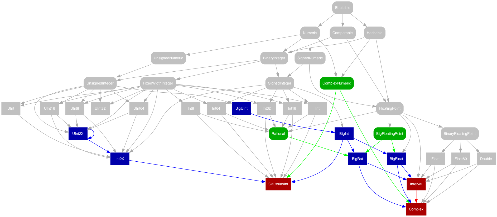
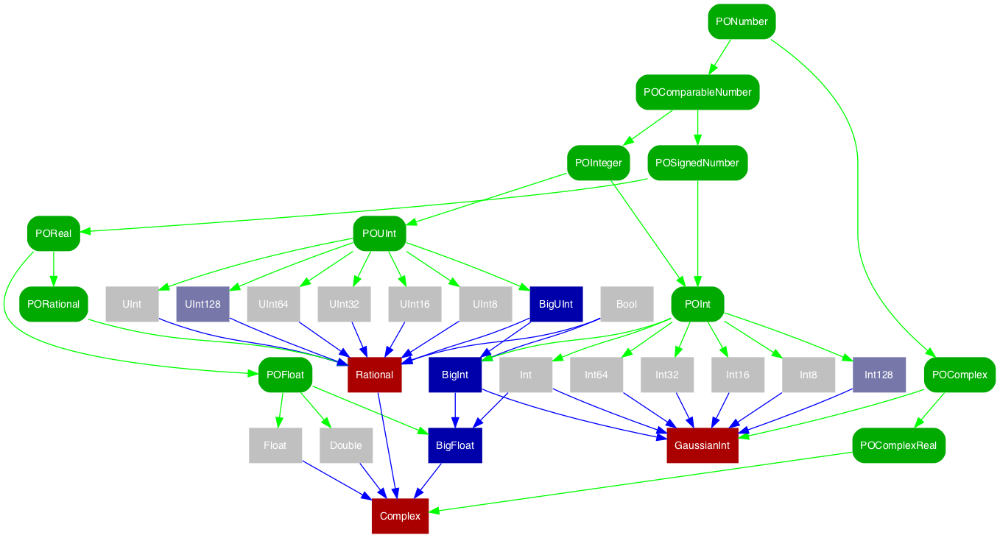

[](https://swift.org)
[](LICENSE)
[](http://travis-ci.org/dankogai/swift-pons)

# swift-pons

Protocol-Oriented Number System in Pure Swift

## Synopsis

```swift
import PONS
```

## Description


[SE-0104]: https://github.com/apple/swift-evolution/blob/master/proposals/0104-improved-integers.md



