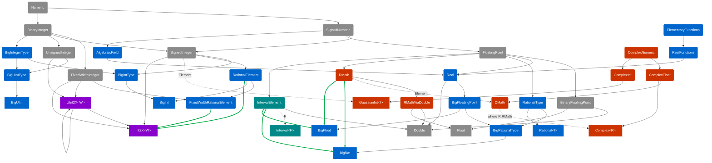

[](https://swift.org)
[](LICENSE)
[](https://github.com/dankogai/swift-pons/actions/workflows/swift.yml)

# swift-pons

Protocol-Oriented Number System in Pure Swift

## Synopsis

```swift
import PONS

let bi = BigInt(1) << 1024 - 1              // BigInt
let bq = BigInt(1).over(BigInt(2))          // BigRat, exactly 1/2
let fq = Int1024(1).over(7)                 // Rational<Int1024>, exactly 1/7
let bf = BigFloat(bq)                       // BigFloat
BigFloat.acos(bf)                           // its math functions...
BigFloat.acos(bf, precision: 256)           // ...to any precision you ask
let cd = Complex.sqrt(-1.0)                 // Complex<Double>
let pi = BigFloat.PI(precision: 128)
let cf = Complex.exp(pi.i)                  // Complex<BigFloat>: e^(πi) == -1
BigInt(2) ** 256                            // exponentiation, exact
1.0.i ** 2                                  // exactly -1 + 0i: no pow() round trip
BigFloat(1) ± BigFloat(2) ** -10            // Interval<BigFloat>
Interval.sqrt(2.0 ± 0.001)                  // brackets sqrt(2), guaranteed
// and more!
```

## Description

Back in the day of Swift 2, PONS was created to demonstrate

```swift
func fib<T:SomeType>(_ n:T)->T {
    return n < 2 ? n: (2...Int(n)).reduce((T(0), T(1))){
        (p, _) in (p.1, p.0 + p.1)
    }.1
}

let F93  = fib(93 as UInt64)
let F666 = fib(666 as BigInt)
```

is possible.  With [SE-0104] which is implemented in Swift 4, you can do that out-of-the-box.  Just replace `SomeType` with `BinaryInteger` and it just works.  Ironically that [broke the previous version] but I am glad Swift has evolved the way it should be.  What I was not so happy about was that PONS was more than a prototype of protocol-oriented numeric types.  It offered

[SE-0104]: https://github.com/apple/swift-evolution/blob/master/proposals/0104-improved-integers.md
[broke the previous version]: https://github.com/dankogai/swift2-pons

* Arbitrary-precision Integer (`BigInt`)
* Arbitrary-precision Rational (`BigRat`)
* Arbitrary-precision Floating Point (`BigFloat`)
* Generic `Complex`

and so forth.  So they were restored -- this time on top of the Swift Standard Library, split into packages, with PONS as the aggregator that binds them:

* [BigNum]: arbitrary-precision arithmetic -- `BigInt`, `BigUInt`, `BigRat` and `BigFloat`, with math functions that take a `precision:` argument
* [Complex]: complex numbers.  Any `FloatingPoint` can be its `.real` and `.imag`; elements conforming to `RMath` get the math functions, at their native precision.  To avoid misuse, complex integers are named `GaussianInt`.
* [Interval]: interval arithmetic.  `1.0 ± 0.5` is an `Interval<Double>`, and the math functions return intervals guaranteed to bracket the true result.
* [Int2X]: double-width integers, recursively built as `typealias Int128 = Int2X<UInt64>` all the way up to `Int1024`

[BigNum]: https://github.com/dankogai/swift-bignum
[Complex]: https://github.com/dankogai/swift-complex
[Interval]: https://github.com/dankogai/swift-interval
[Int2X]: https://github.com/dankogai/swift-int2x

PONS itself stays thin: it re-exports the modules above, declares the retroactive conformances that make them play together -- `BigRat` and `BigFloat` as `Complex` and `Interval` elements, `Int2X` as a `Rational` element -- and owns the `**` operator, declared exactly once so the packages' own operator modules never collide.  (`±` comes from Interval itself, whose declaration nothing else duplicates.)

## The Type Tree

Protocols are rounded, concrete types are square.  Gray comes from the Swift Standard Library; everything else is colored by the package that declares it.  The thick arrows are the conformances PONS adds retroactively -- the glue that makes `Complex<BigFloat>` and `Rational<Int1024>` possible.


```mermaid
graph TD
  classDef stdlib   fill:#8a8a8a,stroke:none,color:#fff
  classDef bignum   fill:#0066cc,stroke:none,color:#fff
  classDef complex  fill:#cc3300,stroke:none,color:#fff
  classDef interval fill:#008888,stroke:none,color:#fff
  classDef int2x    fill:#8800cc,stroke:none,color:#fff
  classDef ponsglue fill:#00aa44,stroke:none,color:#fff

  %% Swift Standard Library
  Numeric(Numeric):::stdlib
  SignedNumeric(SignedNumeric):::stdlib
  BinaryInteger(BinaryInteger):::stdlib
  SignedInteger(SignedInteger):::stdlib
  UnsignedInteger(UnsignedInteger):::stdlib
  FixedWidthInteger(FixedWidthInteger):::stdlib
  FloatingPoint(FloatingPoint):::stdlib
  BinaryFloatingPoint(BinaryFloatingPoint):::stdlib
  Double[Double]:::stdlib
  Float[Float]:::stdlib

  Numeric --> SignedNumeric
  Numeric --> BinaryInteger
  BinaryInteger --> FixedWidthInteger
  BinaryInteger --> SignedInteger
  BinaryInteger --> UnsignedInteger
  SignedNumeric --> SignedInteger
  SignedNumeric --> FloatingPoint
  FloatingPoint --> BinaryFloatingPoint
  BinaryFloatingPoint --> Double
  BinaryFloatingPoint --> Float

  %% BigNum
  ElementaryFunctions(ElementaryFunctions):::bignum
  RealFunctions(RealFunctions):::bignum
  AlgebraicField(AlgebraicField):::bignum
  Real(Real):::bignum
  BigFloatingPoint(BigFloatingPoint):::bignum
  BigIntegerType(BigIntegerType):::bignum
  BigIntType(BigIntType):::bignum
  BigUIntType(BigUIntType):::bignum
  RationalElement(RationalElement):::bignum
  FixedWidthRationalElement(FixedWidthRationalElement):::bignum
  RationalType(RationalType):::bignum
  BigRationalType(BigRationalType):::bignum
  BigUInt[BigUInt]:::bignum
  BigInt[BigInt]:::bignum
  Rational["Rational&lt;I&gt;"]:::bignum
  BigRat[BigRat]:::bignum
  BigFloat[BigFloat]:::bignum

  ElementaryFunctions --> RealFunctions
  SignedNumeric --> AlgebraicField
  FloatingPoint --> Real
  RealFunctions --> Real
  AlgebraicField --> Real
  Real --> BigFloatingPoint
  Real --> Double
  BinaryInteger --> BigIntegerType
  BigIntegerType --> BigIntType
  SignedInteger --> BigIntType
  BigIntegerType --> BigUIntType
  UnsignedInteger --> BigUIntType
  BigIntType --> BigInt
  BigUIntType --> BigUInt
  SignedInteger --> RationalElement
  RationalElement --> FixedWidthRationalElement
  FixedWidthInteger --> FixedWidthRationalElement
  RationalElement --> BigInt
  FloatingPoint --> RationalType
  RationalType --> BigRationalType
  BigFloatingPoint --> BigRationalType
  RationalType --> Rational
  BigRationalType --> BigRat
  BigFloatingPoint --> BigFloat

  %% Complex
  ComplexNumeric(ComplexNumeric):::complex
  ComplexFloat(ComplexFloat):::complex
  CMath(CMath):::complex
  ComplexInt(ComplexInt):::complex
  RMath(RMath):::complex
  RMathViaDouble(RMathViaDouble):::complex
  Complex["Complex&lt;R&gt;"]:::complex
  GaussianInt["GaussianInt&lt;I&gt;"]:::complex

  ComplexNumeric --> ComplexFloat
  ComplexNumeric --> ComplexInt
  ComplexFloat --> CMath
  FloatingPoint --> RMath
  RMath --> RMathViaDouble
  RMathViaDouble --> Double
  RMathViaDouble --> Float
  RMath -. "Element" .-> CMath
  ComplexFloat --> Complex
  CMath -. "where R:RMath" .-> Complex
  ComplexInt --> GaussianInt
  SignedInteger -. "Element" .-> GaussianInt

  %% Interval
  IntervalElement(IntervalElement):::interval
  Interval["Interval&lt;F&gt;"]:::interval
  FloatingPoint --> IntervalElement
  IntervalElement --> Double
  IntervalElement -. "F" .-> Interval

  %% Int2X
  UInt2X["UInt2X&lt;W&gt;"]:::int2x
  Int2X["Int2X&lt;W&gt;"]:::int2x
  FixedWidthInteger --> UInt2X
  UnsignedInteger --> UInt2X
  FixedWidthInteger --> Int2X
  SignedInteger --> Int2X
  UInt2X --> Int2X
  UInt2X --> UInt2X

  %% PONS retroactive glue
  RMath ==> BigRat
  RMath ==> BigFloat
  RationalElement ==> Int2X
  FixedWidthRationalElement ==> Int2X
  IntervalElement ==> BigRat
  IntervalElement ==> BigFloat

  linkStyle 55,56,57,58,59,60 stroke:#00aa44,stroke-width:3px
```

The green edges are declared in PONS, and they are all one-liners:

```swift
extension BigRat:   @retroactive RMath {}
extension BigFloat: @retroactive RMath {}
extension Int2X:    @retroactive RationalElement {}
extension Int2X:    @retroactive FixedWidthRationalElement {}
extension BigRat:   @retroactive IntervalElement {}
extension BigFloat: @retroactive IntervalElement {}
```

`BigRat` and `BigFloat` already speak `RMath` natively -- the protocol was designed around their vocabulary, `precision:` arguments included -- so conforming them makes `Complex<BigRat>` and `Complex<BigFloat>` full `CMath` citizens.  Likewise `Int2X` is already a `FixedWidthInteger`, so one empty conformance buys `Int1024(1).over(7)`.

If your markdown renderer does not speak mermaid, the same graph is pre-rendered as [graph/typetree.svg](graph/typetree.svg), from the extracted source [graph/typetree.mmd](graph/typetree.mmd).  (The pre-SwiftPM versions, in graphviz form, remain under [graph/](graph/) for the archeologically inclined.)

## The `**` Operator

Swift has no exponentiation operator, and [BigNumOperators] and [ComplexOperators] each declare one -- which is exactly why PONS does not import either: two operator declarations, however identical, make every use site ambiguous.  PONS declares `**` once, for the whole menagerie:

[BigNumOperators]: https://github.com/dankogai/swift-bignum
[ComplexOperators]: https://github.com/dankogai/swift-complex

```swift
2 ** 10                 // 1024,  Int
BigInt(2) ** 256        // exact, BigInt
2.0 ** 0.5              // pow,   Double
BigRat(1,2) ** 3        // exact, BigRat
1.0.i ** 0.5            // pow,   Complex<Double>
1.0.i ** 2              // exactly -1: integer exponents multiply, O(log n)
```

## Usage

### build

```sh
$ git clone https://github.com/dankogai/swift-pons.git
$ cd swift-pons # the following assumes your $PWD is here
$ swift build
```

### REPL

Simply

```sh
$ swift run --repl
```

and in your repl,

```sh
  1> import PONS
  2> BigFloat.sqrt(2, precision: 256)
$R0: BigFloat = ...
```

### From Your SwiftPM-Managed Projects

Add the following to the `dependencies` section of `Package.swift`:

```swift
.package(url: "https://github.com/dankogai/swift-pons.git", from: "6.0.0")
```

and the following to the dependencies of your target:

```swift
.product(name: "PONS", package: "swift-pons")
```

Now all you have to do is:

```swift
import PONS
```

in your code.  Enjoy!

### Prerequisite

Swift 6 or better, macOS or Linux to build.
